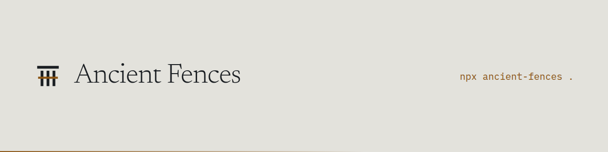

<picture>
  <source media="(prefers-color-scheme: dark)" srcset="assets/readme-banner.png">
  
</picture>

# Ancient Fences

**Find the code you wrote because of someone else's bug. Then check whether that bug is still there.**

Dependabot bumps the version. Nobody removes the workaround you wrote because
the old version was broken.

```bash
npx ancient-fences .           # what is standing in this codebase
npx ancient-fences . --check   # and whether the reasons still hold
```

No installation, no configuration, no account. It reads the repository you
point it at and prints what it found.

## The problem

You hit a bug in a library. You write code around it and, if you are decent, leave a note:

```js
// Workaround for https://github.com/some/lib/issues/2500 (remove when fixed)
```

Then the bug gets fixed. The issue is closed. The library is replaced. And
nothing happens, because there is no link between someone else's tracker and
your code. The workaround stays forever, and after two years nobody dares
touch it: the note says "bug", so maybe the bug is still there.

This is Chesterton's Fence at industrial scale. The code knows the fence is
there. Git knows how long it has stood. Nobody checks whether the reason
still exists.

## Real example

In `webpack`, `test/configCases/plugins/terser-plugin/extract.js:3`:

```js
// ⚠️ move the following comment back to the top
// https://github.com/mishoo/UglifyJS2/issues/2500
```

Written **2017-11-08**. The referenced issue is closed. Webpack dropped
UglifyJS for terser in 2018. The string `uglify` does not appear in its
`package.json` even once. The directory is literally named `terser-plugin`.
The fence has stood untouched for **8.8 years**, guarding a hole in a road
that no longer exists.

Two runs, full clones, August 2026:

| Repository | Fences | Because of someone else's bug | Untouched 3+ years | Oldest |
|---|---|---|---|---|
| puppeteer/puppeteer | 77 | 62 | 48 | 9.1 yr |
| webpack/webpack | 93 | 65 | 23 | 8.8 yr |

Both are well-maintained projects by good engineers. That is the point.

Measured on a full clone, because a shallow one cannot date a line. Numbers
from earlier versions were higher and worse: counting the word "until" as
evidence turned two hundred ordinary comments in webpack into findings. A
number you have to discount is not worth printing.

## What it finds

| Kind | What it means | The repair when the reason dies |
|---|---|---|
| `code` | code written because of someone else's bug | delete the workaround |
| `docs` | a documented limitation pointing at an issue | the docs now lie, so fix them |
| `deadline` | a date written into a comment | the date passed, revisit |
| `unmarked` | clearly a workaround, no recorded reason | write the reason down, or remove it |

A comment counts as a fence when it links to an external tracker, or says
something that only a fence says ("workaround", "kludge", "no longer needed",
"do not upgrade"). Words that merely appear in fences ("until", "polyfill",
"temporary", "regression") count only when the comment also names the
condition: a deadline or a version. Phrases that read as prose elsewhere
("remove this", "blocked by") count next to a `TODO`, `FIXME` or `HACK`, or
next to a named condition. Comment markers are read per language, so `#fff` in
a stylesheet and `a // b` in Python are not comments.

Trackers understood: GitHub issues and pull requests, Chromium (`crbug.com`),
Mozilla Bugzilla, WebKit.

## Verdicts

`remove` · `upgrade first` · `review` · `still valid` · `unchecked` · `unmarked`

A closed issue is weak evidence on its own. With `--check`, Ancient Fences also
reads the version the fix shipped in (a release milestone, or "fixed in 1.2.3"
in the issue) and compares it against your lockfile:

```
VERDICT:  remove (fix shipped in 0.30.0 (milestone), you run sharp 0.33.1)
VERDICT:  upgrade first (fix shipped in 0.34.0, but sharp is pinned at 0.33.1)
```

Those are two different jobs. The first is code you can delete this afternoon.
The second is the more uncomfortable finding: you are still paying to maintain
a workaround for a bug that was fixed years ago, because nobody upgraded.

`package-lock.json`, `yarn.lock` and `pnpm-lock.yaml` are read when present. No
lockfile means the tool says less, never something false.

Fence age comes from `git blame`, which needs history. In a shallow clone
(`--depth 1`, and every default CI checkout) git dates every line to the day it
was fetched, so the report says age was not measured rather than printing a
confident zero.

**An unknown issue state never produces `still valid`.** Not knowing is not a
green light. A tool that reassures you without grounds is worse than no tool.
(The test enforcing this caught a real bug on the prototype's first run.)

## Options

```
--check             ask GitHub whether the referenced issues are still open
                    (set GITHUB_TOKEN to lift the 60 requests/hour limit)
--report[=file]     write a shareable HTML report (default: ancient-fences.html)
--tasks[=file]      write the dead fences as instructions for a coding agent
--api-base=URL      alternate API (GitHub Enterprise, or a mock in tests)
--json              full machine-readable output
--no-blame          skip fence age (faster, tells you less)
--include-generated scan bundles and minified builds too
--cache=FILE        where to keep issue states
--no-cache          ignore cached state and ask the tracker again
--max-age-days=N    how old a cached state may be before it is re-checked
                    (default 7)
```

An option this tool does not recognise stops the run. A mistyped `--chek`
used to print a normal report, and the reader believed the trackers had been
consulted.

You can also point it at a single file: `npx ancient-fences src/thing.js`.

Bundles committed into a repository (`vendor.js`, a browserify or webpack
build, anything minified) are skipped, and the summary says how many were left
out. The fences inside them belong to the libraries they were built from, so
listing them buries the ones your team can actually act on. `dist`, `build`,
`node_modules`, `vendor` and `third_party` are skipped for the same reason.

Issue states are cached in your user cache directory (`$XDG_CACHE_HOME`,
`%LOCALAPPDATA%`, or `~/.cache`), never inside the repository being scanned.
Every entry records when it was read, entries older than a week are re-checked,
and if the tracker cannot be reached the report says which day the answer is
from:

```
VERDICT:  remove (reason disappeared 2021-04-02 (state as of 2026-08-18))
```

An issue state is a snapshot, not a fact. Closed issues get reopened.

## Working with an agent

Ancient Fences does not edit your code, and that is deliberate. Knowing that a
fence is dead is the scarce part; every editor now ships something that can do
the deleting. So `--tasks` writes the verified findings as work:

```bash
npx ancient-fences . --check --tasks
```

You get a markdown file with one entry per dead fence: the file and line, the
reason originally recorded, what proves it no longer holds, and the instruction
("remove the workaround and the comment, then run the test suite"). Point Claude
Code, Cursor, Copilot or your own script at it. The tests are the safety net,
which is why the instruction always ends there.

## Tests

```bash
npm test
```

The tracker tests run against a mock GitHub API on localhost, so they work
offline and without a token.

## Status

Early, but real. Detection, ageing, issue checking, fix-version matching against
the lockfile, the HTML report and agent tasks all work and are covered by tests
that run offline. Not there yet: `@ancient premise:` annotations for conditions
that live outside a tracker (a contract, a vendor limit, a certificate expiry),
trackers other than GitHub and Chromium, and a GitHub Action that comments on
pull requests.

## Ancient Code

Ancient Fences answers one question about one repository. The same blindness
applies to everything else nobody re-checks in a long-running codebase: what
was already paid for, which parts only one person understands, whether the
whole thing could be handed to another team at all. That is
[Ancient Code](https://ancientcode.net). This tool is its open-source front door.

MIT licensed.
